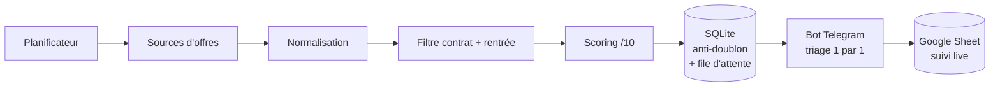

# Alternance Hunter

**Radar d'offres finance automatisé.** Il agrège les offres, les note selon un profil personnalisé, et livre les meilleures directement sur Telegram, une par une, avec un suivi qui se met à jour tout seul dans Google Sheets.

Projet personnel né d'un constat simple : dans une recherche d'alternance ou de stage en finance, la concurrence est rude et les bonnes offres partent vite. Rafraîchir dix plateformes à la main plusieurs fois par jour n'est pas tenable. Alternance Hunter fait ce travail à ma place, avec précision, et ne me sollicite que pour les offres qui valent vraiment le coup.

---

## Ce qu'il fait

- **Agrège plusieurs sources** : l'API officielle de l'alternance (La Bonne Alternance, service de l'État / France Travail) et des sources d'emploi publiques complémentaires, via une interface de source extensible. Objectif : maximiser la couverture pour ne rien louper.
- **Score chaque offre sur 10** selon un profil paramétrable : mots-clés métier (M&A, Private Equity, Corporate Finance...), employeurs cibles (banques d'affaires, boutiques, fonds), niveau de diplôme, et exclusions dures (ex : écarter le juridique même si l'intitulé mentionne "M&A").
- **Filtre par rentrée visée** : ne garde que les offres d'une campagne précise (ex : rentrée septembre 2027), en lisant la date de début ou l'année annoncée dans l'intitulé.
- **Filtre le type de contrat, strictement** : alternance d'un côté, stage de l'autre, jamais de mélange (un poste "graduate" ou un CDI est écarté du flux alternance).
- **Livre sur Telegram, une offre à la fois** : pas de mur de notifications. Le bot propose une carte, on tranche (Retenir / Passer / Pause), la suivante arrive. Impossible d'être noyé ou de sauter une offre.
- **Tient un Google Sheet vivant** : les offres retenues, candidatées et leur statut se synchronisent en direct, avec mise en forme conditionnelle par résultat. Une seule source de vérité, jamais quarante versions du même fichier.
- **Tourne en autonomie** : planifié plusieurs fois par jour sur la machine, il ne réveille l'utilisateur que quand une offre pertinente sort.

---

## Architecture



Le principe clé : chaque offre est stockée en base **avant** d'être proposée. Même hors-ligne ou après un redémarrage, rien n'est perdu et rien n'est proposé deux fois.

---

## Stack technique

| Domaine | Outils |
|---|---|
| Langage | Python 3 |
| Données | API REST officielle, SQLite, sources HTML publiques |
| Livraison | Bot Telegram (API brute + long polling) |
| Suivi | Google Sheets API (`gspread` + compte de service) |
| Automatisation | `launchd` (planification macOS) |
| Config | YAML centralisé, secrets isolés hors du dépôt |

---

## Points techniques mis en avant

- **Moteur de scoring maison** : pondération intitulé vs description, bonus employeurs cibles, exclusions simples et dures, tolérant aux accents et à la casse.
- **Interface de source extensible** : ajouter une source = déposer un module exposant une fonction `fetch()` et l'activer dans la config. Le reste du pipeline ne change pas.
- **Robustesse** : anti-doublon par URL, file d'attente persistante, dégradation propre si une source tombe (le scan continue sur les autres).
- **UX pensée** : file une-par-une, pause/reprise, dernier clic humain conservé, suivi coloré automatique.
- **Autonomie** : de la collecte à la notification, sans intervention.

---

## Installation

```bash
git clone https://github.com/gab-spie/alternance-hunter.git
cd alternance-hunter
python3 -m venv venv && source venv/bin/activate
pip install -r requirements.txt
cp config.example.yaml config.yaml   # puis adaptez vos critères
```

Les identifiants (jeton d'API, bot Telegram, compte de service Google) se placent dans un dossier `secrets/` volontairement exclu du dépôt. Voir [`docs/ABOUT.md`](docs/ABOUT.md) pour le détail.

```bash
python3 scan.py alternance        # un scan
python3 telegram_bot.py alternance  # le bot de triage
```

---

## Documentation

- [`docs/ABOUT.md`](docs/ABOUT.md) : ce que fait le projet, en détail.
- [`docs/ARCHITECTURE.md`](docs/ARCHITECTURE.md) : le flux, module par module.
- [`docs/SKILLS.md`](docs/SKILLS.md) : les compétences mobilisées.

---

## Statut

Opérationnel sur le volet alternance (collecte, scoring, Telegram, Google Sheets, planification). Volet stage et sources internationales en cours.

## Licence

MIT. Projet personnel, à but non commercial.
