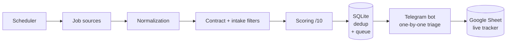

# Career Hunter

**Automated finance-job radar (work-study and internships).** It aggregates offers, scores them against a personal profile, and delivers the best ones one at a time on Telegram, with a tracker that keeps itself up to date in Google Sheets.

A personal project born from a simple observation: in a finance work-study or internship search, competition is fierce and good offers go fast. Refreshing ten job boards by hand several times a day is not sustainable. Career Hunter does that work for me, precisely, and only pings me for offers that are actually worth it.

---

## What it does

- **Aggregates sources through an extensible interface**: ships with a connector for the official work-study API (La Bonne Alternance, a French public service backed by France Travail); additional public job sources can be plugged in without touching the pipeline. The goal is broad coverage so little slips through.
- **Scores every offer out of 10** against a configurable profile: role keywords (M&A, Private Equity, Corporate Finance...), target employers (investment banks, boutiques, funds), degree level, and hard exclusions (e.g. drop legal roles even when the title mentions "M&A").
- **Filters by target intake**: keeps only a specific campaign (e.g. September 2027), based on the start date or the year stated in the title.
- **Strict contract-type filter**: work-study on one side, internships on the other, never mixed (a "graduate" or permanent role is dropped from the work-study feed).
- **Delivers on Telegram, one offer at a time**: no wall of notifications. The bot shows a card, you decide (Keep / Skip / Pause), the next one comes. Impossible to be flooded or to miss an offer.
- **Keeps a live Google Sheet**: kept offers, applications and their status sync in real time, with conditional formatting by outcome. A single source of truth.
- **Runs autonomously**: scheduled several times a day, it only wakes me when a relevant offer shows up.

---

## Architecture



Key principle: every offer is stored **before** being proposed. Even offline or after a restart, nothing is lost and nothing is proposed twice.

---

## Tech stack

| Area | Tools |
|---|---|
| Language | Python 3 |
| Data | Official REST API, SQLite, public sources |
| Delivery | Telegram bot (raw API + long polling) |
| Tracking | Google Sheets API (`gspread` + service account) |
| Automation | `launchd` (macOS scheduling) |
| Config | Centralized YAML, secrets kept out of the repo |

---

## Technical highlights

- **Custom scoring engine**: title-vs-description weighting, target-employer bonus, soft and hard exclusions, accent- and case-insensitive.
- **Extensible source interface**: a source is any module exposing `fetch(profile, config)` and returning normalized offers. The contract lives in [`sources/base.py`](sources/base.py), with a ready-to-copy template in [`sources/example_source.py`](sources/example_source.py). The rest of the pipeline is untouched.
- **Robustness**: URL and cross-source deduplication, persistent queue, WAL + busy-timeout for safe concurrent access, graceful degradation if a source fails (the scan continues on the others), atomic file writes.
- **Tested**: unit tests on the real logic (scoring, contract and intake filters, deduplication) with `pytest`.
- **Thoughtful UX**: one-by-one queue, pause/resume, the final click stays human, automatic color-coded tracking.
- **Autonomy**: from collection to notification, no manual step.

---

## Setup

```bash
git clone https://github.com/gab-spie/career-hunter.git
cd career-hunter
python3 -m venv venv && source venv/bin/activate
pip install -e ".[dev]"              # installs the package + test deps
cp config.example.yaml config.yaml   # then adjust your criteria
```

Credentials (API token, Telegram bot, Google service account) live in a `secrets/` folder deliberately excluded from the repo. Details in [`docs/ABOUT.md`](docs/ABOUT.md).

```bash
python3 scan.py alternance          # one scan
python3 telegram_bot.py alternance  # the triage bot
pytest                              # run the test suite
```

---

## Documentation

- [`docs/ABOUT.md`](docs/ABOUT.md): what the project does, in detail.
- [`docs/ARCHITECTURE.md`](docs/ARCHITECTURE.md): the flow, module by module.
- [`docs/SKILLS.md`](docs/SKILLS.md): the skills involved.

---

## Status

Operational on the work-study side (collection, scoring, Telegram, Google Sheets, scheduling). Internship side and international sources in progress.

> **A note on language.** Documentation, configuration, comments and messages are in English. A few internal identifiers keep the author's French naming: the offer/DB field names (`titre`, `entreprise`, `lieu`...) and the profile ids `alternance` / `stage`, which are the French work-study and internship contracts and also serve as the CLI argument.

## License

MIT License. A personal project.
